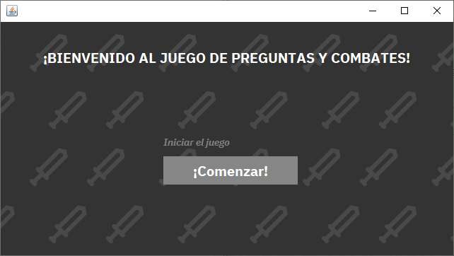
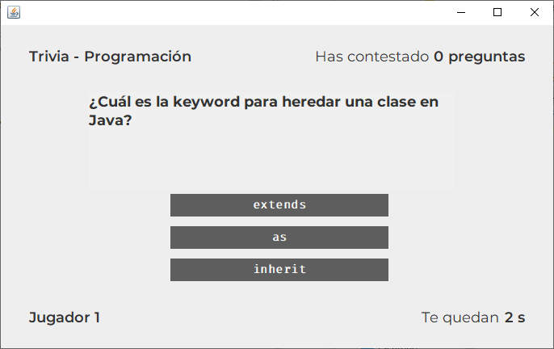
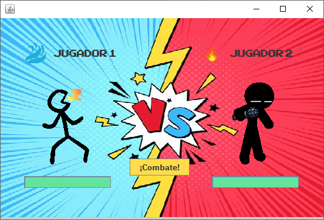
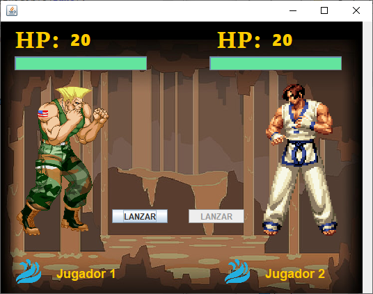
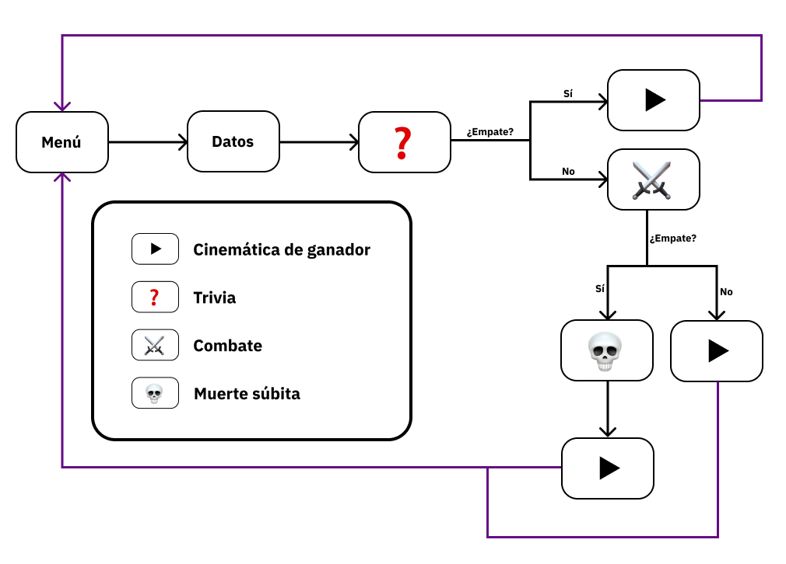

# Fight Game

Este proyecto forma parte del curso Programación Orientada a Objetos.

Videojuego de dos jugadores compuesto por tres modalidades:

- Trivia
- Combate
- Muerte súbita

## Modalidades del juego

Esta sección describe las tres modalidades de juego presentes en la aplicación.

### Trivia

En esta modalidad de juego se presentan preguntas aleatorias a los jugadores sobre los temas de Programación, Cultura General y Matemáticas.

### Combate

En esta modalidad de juego, los jugadores se enfrentan utilizando sus habilidades primarias y secundarias para determinar un ganador.

### Muerte súbita

En esta modalidad de juego, los jugadores se enfrentan en un duelo al azar. Cada uno cuenta con 20 puntos de vida y tienen que lanzar un dado por turnos. La cantidad de puntos que obtenga cada uno será la cantidad de puntos de vida que se le restará a su oponente.

## Flujo del programa

Esta sección describe el flujo del programa.

- Se selecciona el botón Iniciar! en el Menú Principal.
- Los jugadores ingresan sus datos (Nombre, habilidad principal y habilidad secundaria).
- Los jugadores se enfrentan en la modalidad de juego Trivia.
- Los jugadores se enfrentan en la modalidad de juego Combate.
- Los jugadores se enfrentan en la modalidad de juego Muerte Súbita.
- Si se determina un ganador en cualquiera de las modalidades, la aplicación regresa al Menú Principal.
- Se repite todo otra vez.

## Reconocimientos

- Cinemáticas utilizadas obtenidas de los videos del [canal de YouTube de Hyun](https://www.youtube.com/@Hyun)
  - [The Imitator Collab 2 (hosted by Shuriken)](https://www.youtube.com/watch?v=18blt3-tMPM)
  - [One vs Many - Prelude](https://www.youtube.com/watch?v=PvR3_9MCkGw)
- Cinemáticas utilizadas obtenidas de los videos del [canal de YouTube de ArifFatedd](https://www.youtube.com/@AripFateddAnimation)
  - [STICKMAN TOURNEY](https://www.youtube.com/watch?v=vC1zRdEMdDQ)
  - [STICKMAN TOURNEY 2](https://www.youtube.com/watch?v=9l2TciI86GM)
  - [STICKMAN TOURNEY 3](https://www.youtube.com/watch?v=0TJ_rCxJRy4)

La modalidad de Trivia se realizó siguiendo algunas pautas del [juego de trivia de BroCode](https://www.youtube.com/watch?v=wk1Fbqh7Tew).